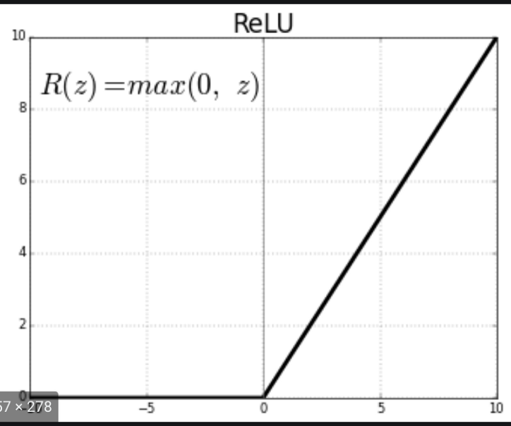
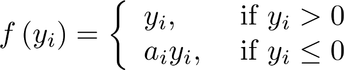
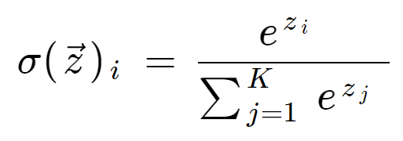

# **Activation function** 

- The Activation Functions can be basically divided into 2 types:
  - Linear Activation Function
  - Non-linear Activation Functions

#### **_Linear Activation Function_**: 
- Equation: f(x) = x 
- It doesn’t help with the complexity parameters of usual data that is fed to the networks.

#### **_Non-linear Activation Function_**: 
1. **Sigmoid Function:**
  
  

  - Range: (0, 1)
  - The larger the input (more positive), the closer the output value will be to 1.0
  - The function is differentiable --> can find the slope of the sigmoid curve at any two points.
  - The function is monotonic but function’s derivative is not
  

2. **Tanh Function:**
  
  

  - Range: (-1, 1)
  - The advantage is that the negative inputs will be mapped strongly negative and the zero inputs will be mapped near zero in the tanh graph.

3. **ReLU Function:** improve th non-linear ability of the network and avoid the gradient disappearance or the gradient explosion after multiple iterations of network.
  
  

  - Range: (0, infinity)
  - The function and its derivative both are monotonic.
  - ReLU family:

  
  
      - Leaky ReLU: aᵢ > 0, f becomes leaky ReLU --> solve a dying ReLU problem
      - PReLU: aᵢ is a learnable parameter
  
 4. **Softmax Function:**

  
  
  - Range: (0, 1)
  - The softmax function is used as the activation function for multi-class classification problems where class membership is required on more than two class labels.
 
