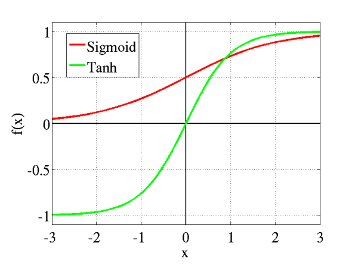

# **Activation function** 

- The Activation Functions can be basically divided into 2 types:
  - Linear Activation Function
  - Non-linear Activation Functions

#### **_Linear Activation Function_**: 
- Equation: f(x) = x 
- It doesn’t help with the complexity parameters of usual data that is fed to the networks.

#### **_Non-linear Activation Function_**: 
1. **Sigmoid Function:**
  
  

  - Range: (0, 1)
  - The larger the input (more positive), the closer the output value will be to 1.0
  - The function is differentiable --> can find the slope of the sigmoid curve at any two points.
  - The function is monotonic but function’s derivative is not
  

2. **Tanh Function:** better than sigmoid function
  
  

  - Range: (-1, 1)
  - The advantage is that the negative inputs will be mapped strongly negative and the zero inputs will be mapped near zero in the tanh graph.
  - It helps in centering the data by bringing mean close to 0 --> learning for next layer mush easier

3. **ReLU Function:** improve th non-linear ability of the network and avoid the gradient disappearance or the gradient explosion after multiple iterations of network.
  
  

  - Range: (0, infinity)
  - The function and its derivative both are monotonic.
  - Computation saving: the derivative of ReLu is 1 for a positive input in back propagation
  - Solving the vanishing gradient problem when the number of layers grows.

  - **ReLU family**:
  

  
  
  - Leaky ReLU: aᵢ > 0, f becomes leaky ReLU
    - As for the ReLU activation function, the gradient is 0 for values of inputs that are less than zero --> deactivate the neurons in that region --> cause dying ReLU problem.
    - Equation: **f(x)=max(0.01*x , x).**
      returns x if it receives any positive input, but for any negative value of x --> gives an output for negative values, not 0
  - PReLU: aᵢ is a learnable parameter
    - In feed-forward networks, each layer learns a single slope parameter.
    - In CNNs we can learn them for each layer or we can learn them for each channel for each layer.
    --> Number of slope parameters to be learned=Number of layers (or sum of all channels in every layer)
  
 4. **Softmax Function:**

  
  
  - Range: (0, 1). Sum of all the probabilities will be equal to 1.
  - The softmax function is used as the activation function for multi-class classification problems.
  - The softmax function is often used in the final layer of a neural network-based classifier.
 
