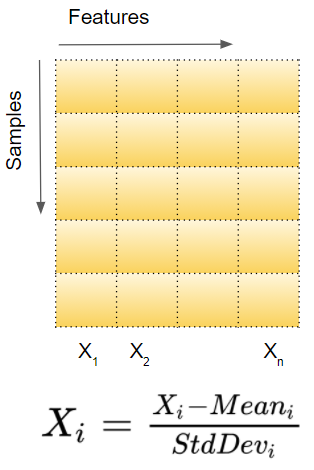
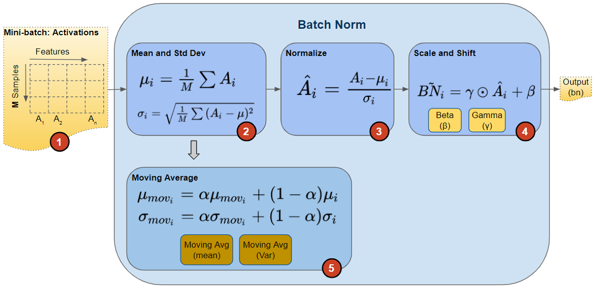

# **Batch Normalization**

**1. Normalizing Input Data**
- When inputting data to a deep learning model, it is standard practice to normalize the data to zero mean and unit variance.
    
  - Features on different scales take longer to reach the minimum
  - Normalized data helps the network converge faster 

**2. Implementing Batch Norm**
- Batch Norm is a network layer that gets inserted between a hidden layer and the next hidden layer
  - Its job is to take the outputs from the first hidden layer and normalize them before passing them on as the input of the next hidden layer.
 
- How does Batch Normalization work?
  - Batch Norm layer has parameters:
    - Two learnable parameters called beta and gamma.
    - Two non-learnable parameters (Mean Moving Average and Variance Moving Average) 
  
    
    - Activation: The activations from the previous layer are passed as input to the Batch Norm.
    - Caluculate Mean and Variance
    - Normalized: normalized values now have mean = 0 and variance = 1
    - Scale and Shift: multiplying the normalized values by a factor, gamma, and adding to it a factor, beta 
    --> values is shifted to a different mean) and scaled (to a different variance)
    - Moving Average: 
        - During training, Batch Norm calculates Exponential Moving Average (EMA). 
        - At the end of training, it simply saves this value as part of the layer’s state
