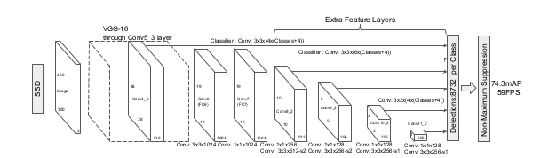
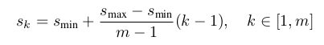
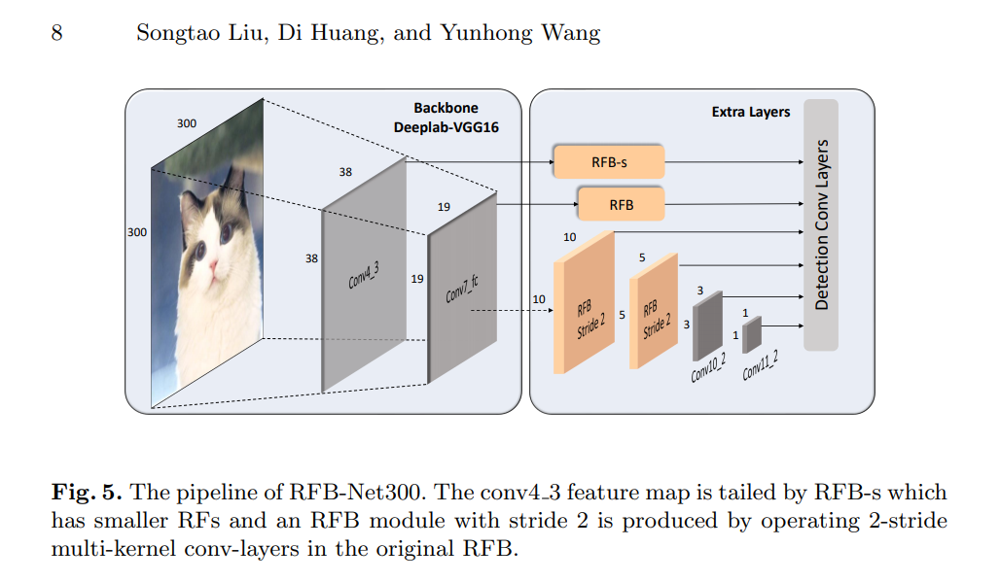

# SSD

> The SSD is based on a feed-forward convolutional network that produces a fixed-size collection of bounding boxes and scores for the presence of object class instances in those boxes, followed by a non-maximum suppression step to produce the final detection.
> 

## Model:

- SSD has 2 components: a backbone model and SSD head.
    - **Backbone model:**
        - **Base Network**: are based on CNN standard architecture used for high quality image classification.
                            
            - VGG-16 is used for feature extraction.
    
    
    
            - Input layer: 300x300x3 / 500x500x3
            - Base Network: From input image to conv-7
                - VGG_16: converts fully-connected layers FC6 and FC7 to conv6, conv7
                
    - **SSD head:** one or more convolutional layers added to this backbone —> produce detections with the following key features:
        - **Multi-scale feature maps for detection - MultiBox objective:** add convolutional feature layers to the end of the truncated based network.
            - These layers decrease in size —> detection of objects in multiple scales.
            - The convolutional model for predicting detection is different for each feature layer >< YOLO operates on a single scale feature map.
        - **Convolutional predictors for detection:**
            - Each added feature layers can produce a fixed set of detection prediction using set of convolutional filters.
            - On top of the SSD network
            - Smaller receptive field can present smaller sized objects, predictions from earlier layers help in dealing with smaller sized objects. —> SSD define hierarchy of grid cells at different layers.
                - For example, 4x4 grid to find smaller objects, 2x2 grid to find mid sized objects, 1x1 grid to find objects that cover the entire image
        - **Default boxes and aspect ratios:**
            - Not all objects are square in shape —> SSD allows pre-defined aspect ratios of the anchor boxes to account
            - Ratio parameter: specify aspect ratios of the anchor boxes associates with each grid cell
            
            ## Training SSD
            
            > The key difference between training SSD and training a typical detector that uses region proposals, is that ground truth information needs to be assigned to specific outputs in the fixed set of detector outputs.
            > 
            - Matching strategy:
                - During training time, the default boxes are matched over aspect ratio, location and scale to the ground truth boxes —> select the boxes with the highest overlap with the ground truth bounding boxes.
            - Training Objective:
                - **Multibox_loss = confidence_loss + alpha * location_loss**
                    - Confidence Loss: the softmax loss over multiple classes confidences
                        
                        
                        
                    - Location Loss: a Smooth L1 loss between predicted bounding boxes and ground truth —> IoU > 0.5: positive matching (predicted bounding box contain object) and IoU < 0.5: negative matching (can remove predicted bounding box from image)
                        
                        
                        
            - Choosing scales and aspect ratios for each default boxes:
                - The scale of the default boxes for each feature map is computed as:
                
                
                
                - s_min = 0.2, s_max=0.9 —> That means the scale at the lowest layer is 0.2 and the scale at the highest layer is 0.9. All layers in between is regularly spaced.
            - Hard negative mining:
                - Keep a ratio of negative to positive examples of around 3:1 —> network needs to learn and be explicitly told what constitutes an incorrect detection
            - Data augmentation:
                - Data Augmentation technique is used handle variants of object sizes and shapes using shearing, zoom in, zoom out, flipping, cropping
                - Making the model more robust to various input object sizes and shapes
                
            - Atrous convolution: FC6 and FC7 use Atrous convolution instead of conventional convolution —> feature maps are large at Conv6 and Conv7 - increase the receptive field while keeping number of parameters relatively fewer compared with conventional convolution.
    ### Receptive Field Block:
    
    - Construction of RFB module by combining multiple branches with different kernels and dilated convolution layers.
    
    
