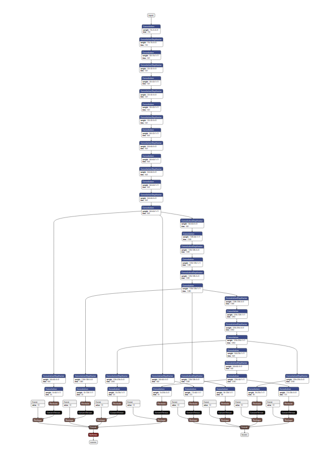

### Ultra-Light-Fast-Generic-Face-Detector-1MB

- Model architecture: 2 versions
    - Version-slim (network backbone)
        - Base Network: MobileNet-Tiny - get a real time object detection algorithm on non-GPU computers and edge device — use convolutional depth wise
        - Head: classification and regression box
            - Architecture:
                
                
                
    - Version-RFB (with the modified RFB module)
        - Base Network: MobileNet-Tiny with the modified RFB module — output is concatenated and apply element-wise before forward activation function.
        - Head: classification and regression box
        - Architecture:
            
            
            
- Train/Test Dataset:
    - Training data set:
        - Wider Face was generated VOC format (annotations - bounding boxes)
        - The clean widerface data pack after filtering out the 10px*10px small face
    - Test: Wider Face with single-scale input resolution 320x240 / VGA 640x480
- Accuracy:
    - In the Wider Face (320x240 resolution / maximum length 320)
        
        Model / Easy Set / Medium Set / Hard Set
        
        - Version-slim: 0.77 / 0.671 / 0.395
        - Version-RFB: 0.787 / 0.698 / 0.438
- Speed:

## LFFD:

- Model architecture:
- Train/Test Dataset:
    - Wider Face dataset: 32204 images and 393703 labelled faces — divided into 3 subsets: training set (40%), validation (10%) and test (50%)
    - FDDB dataset: 2845 images
- Accuracy:
- Speed
